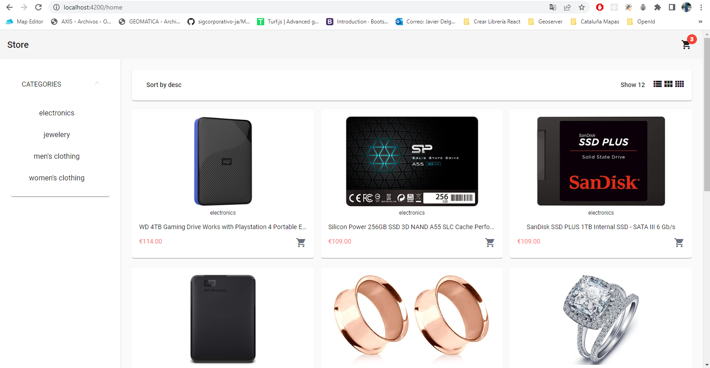
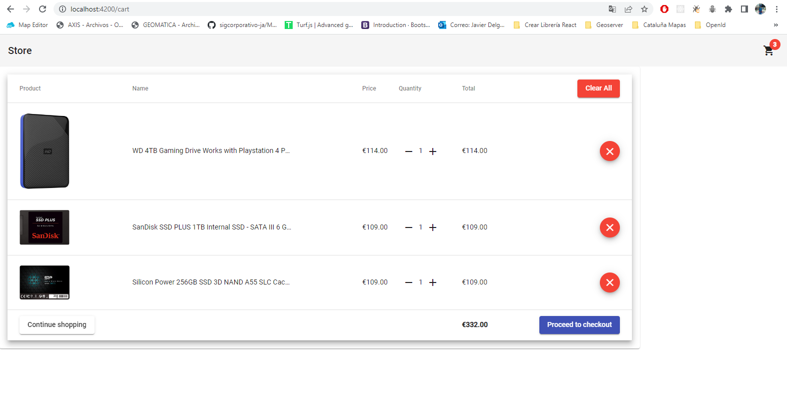
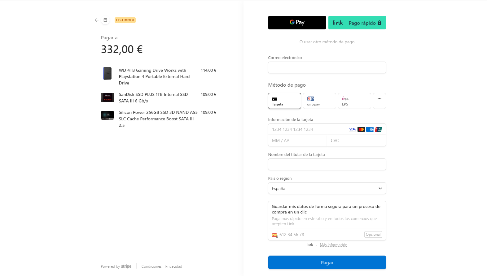

## Example of Ecommerce web

Simple Web Store using angular, tailwind and stripe to test checkout.

### Run Project

Run `ng serve` for a dev server. Navigate to `http://localhost:4200/`. The application will automatically reload if you change any of the source files.

### Run Server

Run `npm start` inside server folder to run express server to connect webstore with stripe and procced to checkout

### Project Images

